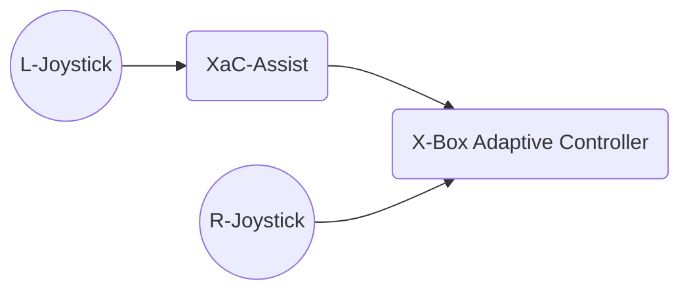

# XaC-Assist (X-Box Adaptive Controller Assistant)

## What is it?

A combination of device and software, the XaC-Assist is an accessory for those who use the [X-Box Adaptive Controller](https://www.xbox.com/en-US/accessories/controllers/xbox-adaptive-controller).

While the XaC is an amazing device, it can pose a couple of challenges for those using it in combination with an external Joystick, such as the [Logitech Extreme 3D Pro](https://www.logitechg.com/en-us/products/space/extreme-3d-pro-joystick.963290-0403.html).  These issues are:

- Only **old** models of the 3D Pro are supported - specifically model # JUF17 - which is only available these days via E-Bay.
- Games which expect axis movement of the joystick for things like selection (think card game) can be challenging for users with motor control challenges.

The XaC-Assist solves both of these with features like:

- Use any input joystick supported by the Linux kernel (including newer models of the 3D Pro)
- Re-map buttons on the external joystick (i.e. make the trigger look like A, or B etc)
- Re-map axes on the external joystick
- Ignore any / all buttons (avoid accidental clicks!)
- Ignore any / all axes (avoid accidental movement)
- Simulate axis movement to compensate for jitter (Reduce/remove accidental scroll, slide, or over-movement!)

### More on Axes Compensation

In the common case, as a joystick is moved in a direction, it sends a number indicating its distance from center.  For instance, as you move the stick left - it sends 'axis 0' values from 0 (center), to -32768 (far left) and in-between.  While useful for many game mechanics (e.g. camera control), some games (I'm looking at you [Eternal](https://www.direwolfdigital.com/eternal/) -- Booooo!) use this for selection.  When a user has challenges with muscle control, a simple "move to the next card to the left" becomes near impossible, as they are unable to move the stick with the level of control necessary to move just one card.  In fact, the author has tried this - without motor challenges - and finds it infuriatingly frustrating.

Enter the XaC-Assist's axes compensation.  It works by watching values from the joystick, and only passing on a movement signal when a significant distance from 0 has been reached, then it simulates a short wait, followed by a simulated 0 signal.  This makes the game see a 'knock left' or similar from the joystick, while the user has only to move the joystick to the left.  Until the stick is centered again, it will not send another signal, avoiding a repeat or additional movement.

### How It Works

The XaC-Assist device sits between a joystick, and the XaC itself:



This allows the device to intercept, pass along, block, change, signals from the Joystick.  Likewise, it can even generate its own events. 

## Reference Device

Any number of devices may be used, so long as they:

- Run Linux
- Has a USB port for Joystick input
- Has a USB-OTG port for emulated Joystick output (to the XaC)

While not strictly required, network connectivity can be used to see and change runtime settings via the software's REST API.

The reference device used by the author is a [Raspberry Pi 4B](https://www.raspberrypi.com/products/raspberry-pi-4-model-b/) with 8G of ram running Rasbian Lite x86 (not x64).  Additionally, the [PiUART](https://www.adafruit.com/product/3589?gclid=CjwKCAjwsMGYBhAEEiwAGUXJaRw6x2xZCnvF1eNaLpeD-HTv4B4Fht-txaLWv7OZxJ51ymjMRRPOEhoCKTQQAvD_BwE) add-on is useful to allow powering the device from a [power-supply](https://www.adafruit.com/product/4298), while leaving the USB-C OTG port for connectivity to the XaC.

### Preparing the OS

Once up and running Linux, the only additional configuration at the OS level needed is to ensure that OTG emulation is possible, by way of the [USB Gadget](https://www.kernel.org/doc/html/v4.19/driver-api/usb/gadget.html) system.  On rasbian, this is accomplished by adding the dwc2 kernel module to /etc/modules, and as an overlay in /boot/config.txt.  Then the emulated device must be created.  The repository has this all in a script which can be used to enable the system.  Note that if the script reboots the system, you will need to run it again post-reboot to finish the process.  See the script in [scripts/configure-pi](https://github.com/nate-yocom/xac-assist/tree/main/scripts/configure-pi).  To run:

```$ sudo ./configure-pi.sh```

## The Software

The software is a small .net 6 (c#) application written to be a Linux systemd service.  The source is in the repository's [src/xac-assist](https://github.com/nate-yocom/xac-assist/tree/main/src/xac-assist) directory.  To build, you will need the [dotnet sdk](https://dotnet.microsoft.com/en-us/download).  The reference build is done on a seperate host (OS X) and pushed to the target device via SSH.  The source folder contains a Makefile with simple targets for:

- install: Creates the appropriate dir structure, and registers the service on the target device
- build: Compiles the application
- push: Pushes the application to the target device
- push-and-run: push + restart the service and then tail the service's log output

You can use environment variables to specify the target user and host:

- PUSH_USER - username to use on the target host
- PUSH_HOST - hostname of the target host

For example, on a fresh deployment, to get bootstrapped:

```$ PUSH_USER=joe PUSH_HOST=machinename make install```

Then during iteration, to build and test:

```$ PUSH_USER=joe PUSH_HOST=machinename make push-and-run```

Note that this is made easier if joe@machinename silently auths with certs/keys or similar.

## Configuration

Once up and running, you have a few options for tweaking how the application behaves.

### The JSON File

The default settings are encapsulated in the [src/xac-assist/controller_settings.json](https://github.com/nate-yocom/xac-assist/blob/main/src/xac-assist/controller_settings.json) file.  These are: 

```json
{
    "inputDevice": "/dev/input/js0",
    "outputDevice": "/dev/hidg0",
    "fireAndResetAxes": [
        0,
        1
    ],
    "waitToReset": 50,
    "fireThreshold": 0.8,
    "resetThreshold": 0.15,
    "ignoreAllButtons": true,
    "ignoreAllAxes": false,
    "ignoredButtons": [],
    "ignoredAxes": [
        2,
        3,
        4,
        5        
    ],
    "mappedButtons": {},
    "mappedAxes": {},
    "allowAxisHoldToFlow": true,
    "axisHoldToFlowHoldTimeMilliseconds": 1500
}
```

To change, you could edit this file then re-deploy.  These settings are:

- inputDevice: The input dev file used to read the joystick events
- outputDevice: The HID OTG gadget to write output to the XaC
- fireAndResetAxes: A list of the axes which should be compensated (as described above)
- waitToReset: How long should a 'fired' compensated axis remain in that state (in milliseconds)
- fireThreshold: At what % of full movement should the axis fire
- resetThreshold: At what % of movement should the axis return to being fireable again
- ignoreAllButtons: Set to true to ignore (and do not pass on) all button input
- ignoreAllAxes: Set to true to ignore (and do not pass on) all axes input
- ignoredButtons: A list of specific buttons to filter out
- ignoredAxes: A list of axes to filter out
- mappedButtons: A dictionary of buttons to their mapped values
- mappedAxes: A dictionary of buttons to their mapped values
- allowAxisHoldToFlow: Boolean indicating whether the values for an axis should be transmitted continually once some threshold 'hold' time is met - i.e. hold-to-scroll
- axisHoldToFlowHoldTimeMilliseconds: The number of milliseconds (fidelity of +/-10ms) to wait before allowing axis data through

### The Web API

Alternatively, once running, the service will listen on port 5000 for HTTP requests.  As a result, you can use the REST API to retrieve the current settings, change them (temporarily), or permenantly set new settings:

#### Getting Current Settings

```bash
$ curl -s http://hostname:5000/config
{
  "inputDevice": "/dev/input/js0",
  "outputDevice": "/dev/hidg0",
  "fireAndResetAxes": [
    0,
    1
  ],
  "waitToReset": 50,
  "fireThreshold": 0.8,
  "resetThreshold": 0.15,
  "ignoreAllButtons": true,
  "ignoreAllAxes": false,
  "ignoredButtons": [],
  "ignoredAxes": [
    2,
    3,
    4,
    5
  ],
  "mappedButtons": {},
  "mappedAxes": {}
}
```

#### Set New Settings

To send new settings, use a POST (for temporary) or PUT (to save the settings to the JSON file) request:

```bash
curl -0 -v -X POST http://hostname:5000/config \
-H 'Content-Type: application/json; charset=utf-8' \
--data-binary @- << EOF
{
  "inputDevice": "/dev/input/js0",
  "outputDevice": "/dev/hidg0",
  "fireAndResetAxes": [
    0,
    1
  ],
  "waitToReset": 50,
  "fireThreshold": 0.8,
  "resetThreshold": 0.15,
  "ignoreAllButtons": true,
  "ignoreAllAxes": false,
  "ignoredButtons": [],
  "ignoredAxes": [
    2,
    3,
    4,
    5
  ],
  "mappedButtons": {},
  "mappedAxes": {}
}
EOF
```

